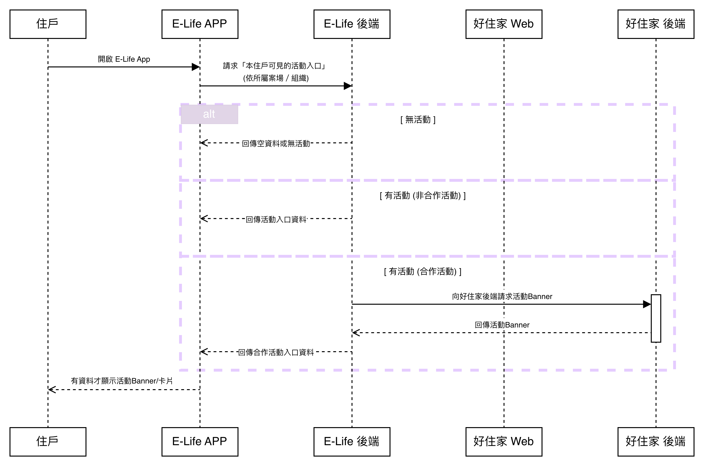
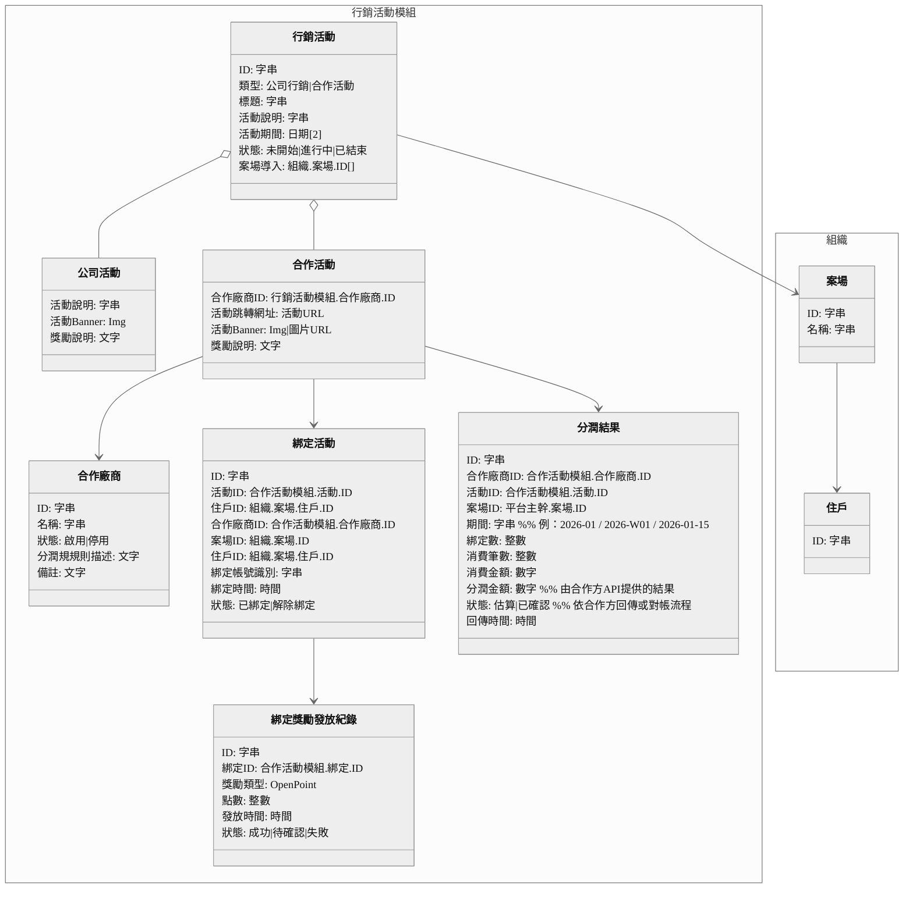

# 系統分析書 - 行銷活動功能分析書

 

# 模組目的與活動樣態
## 目的

- 讓樺康與統一合作規劃活動，並在住戶 App E-Life 露出活動入口（Banner/活動卡）。
- 住戶完成「E-Life 與統一集團好住家 App 的帳號綁定」後，住戶即可獲得 Open Point 點數作為綁定獎勵。
- 在活動期間內，只要住戶「已綁定」且在 好住家 App 有消費行為，就能獲得分潤。
- 後台可管理活動與導入組織、案場，並追蹤綁定成果、消費成果、分潤報表。
- 導入與分潤歸屬以「案場」為單位（哪個社區導入，成效與分潤就歸哪個社區）。

## 活動成立條件
- 住戶在 E-Life 看到活動 → 點「綁定」→ 綁定成功領 Open Point
- 住戶在 好住家 消費 → 樺康取得分潤（活動期間且已綁定才算）
 
 

# 使用者與角色
## 樺康
- 合作營運：建立統一集團合作活動、設定入口素材、指定哪些案場導入、查看成效
- 行銷：曝光率、綁定轉換率、素材/文案版本、活動成效敘事
- 財務：分潤報表（按案場/期間）、必要時匯出彙整
- 客服/營運支援：協助住戶綁定問題、查綁定狀態

## 社區/組織端

- 物管公司/社區管理者：通常只需知道「本站是否導入」與「成效摘要」，不需要能改活動規則

## 住戶端

- 住戶：在 E-Life 綁定好住家、領 Open Point、並在好住家消費
 
 

# Web 端功能說明
## 合作廠商管理
- 建立合作廠商資料（窗口、合作狀態）
- 紀錄合作模式(合作活動時間段、分潤規則紀錄)
- 紀錄合作條款摘要（方便內部查詢）

## 活動管理
- 建立活動：活動名稱、活動期間、活動說明、注意事項
- 設定活動入口素材：Banner/活動卡圖片、標題、引導文案、跳轉規則
- 活動狀態：開放排程 / 已結束

## 導入管理
- 選擇哪些案場／組織導入該活動
- 導入狀態：未導入 / 已導入 / 已停用
- 導入後效果：只有「已導入的案場／組織」，E-Life 才會顯示活動入口

## 綁定成果追蹤
- 成效追蹤（以PIC為例）: 總綁定數、按案場／組織、按期間
- 綁定狀態查詢（客服支援）：案場／組織內帳號列表呈現未綁定 / 已綁定
- 綁定獎勵狀態（Open Point）：成功/待確認/失敗（避免住戶一直問）

## 分潤成果追蹤
- 已綁定住戶在活動期間於好住家消費的成果：筆數、金額、按案場／組織、按期間
- 分潤分析：
  - 哪些 Site 成效最好？
  - 綁定多的 Site 是否也帶來更多消費？
  - 檔期內哪段時間成效最高？

## 分潤報表（Revenue Report）
- 以 案場／組織 為核心的分潤報表
  - 常用維度：期間（日/週/月）、活動、案場／組織
  - 常用指標：綁定數、消費筆數/金額、分潤金額（或估算）
- 匯出：提供財務彙整
 
 

# App 端功能說明
## 活動入口與曝光
- 活動入口呈現：APP內彈窗、首頁 Banner、活動頁、任務中心
- 依 Site 控制可見性：只有「已導入的社區住戶」看得到
- 活動內容頁（以 PIC 為例）：
  - 活動期間、綁定可得 Open Point（點數）說明
  - 活動條件：需綁定 + 活動期間內在好住家消費才算分潤（住戶端可只寫成「享合作優惠/回饋」，分潤不需露出）
  - 常見問題（FAQ）：綁定失敗、點數未入帳、如何取消綁定等

## 綁定引導
- 主要 CTA：「立即綁定好住家，領 Open Point」
- 綁定流程狀態（E-Life 要顯示）
  - 未綁定 → 顯示綁定 CTA
  - 已綁定 → 顯示「已綁定」與後續引導
  - 綁定失敗/取消 → 顯示原因 + 重試

- 前往好住家 App 的導流
  - 綁定完成後顯示「前往好住家使用點數/去消費」按鈕
  - 若未安裝好住家：引導至「下載好住家」 
 
 

## 回饋訊息
- 以 PIC 為例，點數由 PIC 發放，但 E-Life 至少要讓住戶「知道該去哪看、什麼時候會到」。
- 在「綁定成功」畫面提供：
    -「點數將在好住家 App 顯示」的說明（可加預估時間）
    -「我沒收到點數」的客服入口/FAQ
 
 

## 通知（推播/站內通知）
- 綁定成功通知
 
 

## 權益、同意與風險提示
- 綁定前顯示「將與統一集團好住家進行帳號連結」的同意說明
- 解除綁定的路徑說明（至少在 FAQ 告訴住戶怎麼做/找誰）
 
 

## 系統活動流程

## 實體

